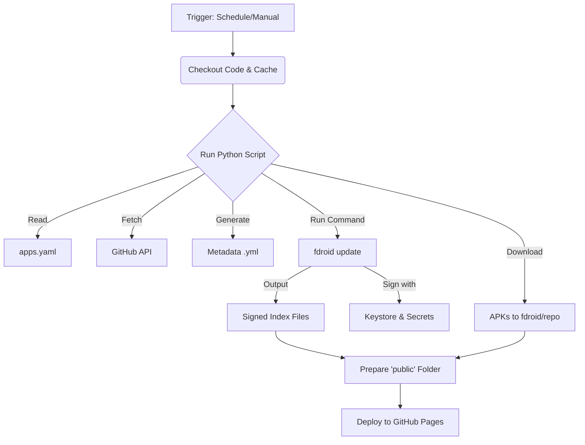

# 🔄 Update Repo Workflow Breakdown

This document provides a deep dive into the **Build CI** workflow (`.github/workflows/update-repo.yml`), which is the heart of this automated F-Droid repository.

It explains exactly how the system goes from "trigger" to "live website update," detailing every step, the code behind it, and what happens in the logs.

---

## 🚀 Workflow Overview

**Name:** `Build CI`
**File:** `.github/workflows/update-repo.yml`
**Schedule:** Runs every 12 hours (`0 */12 * * *`)
**Trigger:** Can also be run manually via "Workflow Dispatch".

### The Flow at a Glance
`Checkout Code` → `Setup Python & Cache` → `Run Update Script` (Download APKs + Generate Index) → `Build Website Folder` → `Deploy to GitHub Pages`

---

## 🔍 Step-by-Step Execution

### 1. Checkout & Environment Setup
Before doing any work, the runner needs the code and tools.

**Code:**
```yaml
- name: Checkout repository
  uses: actions/checkout@v4

- name: Checkout pip cache repository
  uses: actions/checkout@v4
  with:
    repository: UnTamedFury/pip-fdroid-fury
    path: pip-cache
```
**Explanation:**
1.  **Main Repo:** Clones `fury-fdroid` so we have the scripts and config.
2.  **Pip Cache:** Clones a separate repo (`UnTamedFury/pip-fdroid-fury`) containing pre-downloaded Python libraries (`wheels`). This is a critical optimization strategy.

---

### 2. Python Dependency Installation (Optimized)
Instead of downloading `fdroidserver`, `requests`, and `Pillow` from PyPI every single time (which is slow and can hit rate limits), we install them from our local cache.

**Code:**
```yaml
- name: Install Python dependencies from cache
  run: |
    pip install --upgrade pip
    # Try to install from the cached wheel files first
    if [ -d "pip-cache/wheels" ]; then
      pip install --find-links pip-cache/wheels --no-index requests pyyaml fdroidserver gitpython qrcode yamllint || pip install requests pyyaml fdroidserver gitpython qrcode yamllint
    else
      pip install requests pyyaml fdroidserver gitpython qrcode yamllint
    fi
```

**Why this is better:**
*   **Speed:** Installing from local wheels is near-instant compared to downloading.
*   **Reliability:** CI won't fail if PyPI is down or slow.

---

### 3. The Core: Update Script Execution
This is the most complex step. It runs the custom Python script (`scripts/update_fdroid_repo.py`) which orchestrates the entire update process.

**Code:**
```yaml
- name: Create secure config file
  env:
    GH_TOKEN: ${{ secrets.GITHUB_TOKEN }}
    KEYSTORE_PASS: ${{ secrets.KEYSTORE_PASS }}
    KEY_PASS: ${{ secrets.KEY_PASS }}
  run: |
    # Export secrets so the script can see them
    export FDROID_KEY_STORE_PASS="$KEYSTORE_PASS"
    export FDROID_KEY_PASS="$KEY_PASS"
    
    # Run the main logic
    python3 scripts/update_fdroid_repo.py
```

**Deep Dive: What `scripts/update_fdroid_repo.py` actually does**

The script performs three critical sub-tasks:

#### A. Secure Config Injection
The `fdroidserver` tool needs the keystore passwords to sign APKs, but we can't commit them to `config.yml`. The script solves this by dynamically injecting them at runtime.

*Python Code (`scripts/update_fdroid_repo.py`):*
```python
    # Read the current config file
    with open(config_path, 'r') as f:
        config_content = f.read()

    # Replace placeholder values with actual secrets from environment
    if keystore_pass and key_pass:
        secure_config_content = config_content.replace(
            'keystorepass: ${{ secrets.KEYSTORE_PASS }}',
            f'keystorepass: {keystore_pass}'
        ).replace(
            'keypass: ${{ secrets.KEY_PASS }}',
            f'keypass: {key_pass}'
        )

        # Write the secure config temporarily
        with open(config_path, 'w') as f:
            f.write(secure_config_content)
```

#### B. App Processing Loop (Download & Metadata)
It iterates through every app listed in `apps.yaml`. For each app, it fetches the latest release from GitHub and ensures the APK exists locally.

*Python Code (`scripts/update_fdroid_repo.py`):*
```python
    # Process each app
    for app in apps_to_process:
        # ... fetch details from GitHub ...
        
        # Download APK to the app-specific directory for organized storage
        app_specific_apk_path = os.path.join(app_apk_dir, latest_fdroid_apk_filename)
        
        # Ensure APK exists locally even if metadata is up to date (stateless build logic)
        if apk_needs_processing or not os.path.exists(app_specific_apk_path):
            if not os.path.exists(app_specific_apk_path):
                download_file(download_url, app_specific_apk_path)
                print(f"  -> Downloaded APK to app-specific directory: {app_specific_apk_path}")
            else:
                print(f"  -> APK already exists in app-specific directory: {app_specific_apk_path}")
```
*Note: This specific logic handles the "stateless" nature of the repo. Since the runner starts empty, `os.path.exists` returns False, triggering the download every time.*

#### C. F-Droid Index Generation
Once all APKs are downloaded and metadata files (`.yml`) are generated, the script calls the official `fdroid` tool to build the repository index.

*Python Code (`scripts/update_fdroid_repo.py`):*
```python
        # Now run fdroid update to generate the repository index
        print("Updating F-Droid repository index...")
        result = subprocess.run(
            ['fdroid', 'update', '--verbose', '--create-metadata', '--delete-unknown', '--pretty'], 
            cwd=FDROID_DIR, 
            env=env, 
            capture_output=True, 
            text=True
        )
```
This command generates:
*   `index-v1.json` / `index-v2.json`: The file clients download to see apps.
*   `index.xml`: Legacy format.
*   `index-v1.jar`: The **signed** index file that guarantees security.

---

### 4. Prepare Website Content
Now that the repo is built (APKs downloaded, index signed), we need to arrange the files for the web server.

**Code:**
```yaml
- name: Prepare Website Content
  run: |
    mkdir -p public/repo
    cp -r website/* public/
    
    # Copy ALL repository files including APKs and signature files
    cp -r fdroid/repo/* public/repo/
```
**Explanation:**
*   Creates a `public` folder.
*   Copies the landing page (`website/index.html`) to the root of `public/`.
*   Copies the **entire** F-Droid repo (APKs + Index + Signatures) into `public/repo/`.
*   **Result:** A folder structure ready to be served.

---

### 5. Deployment
Finally, publish the `public` folder to the internet.

**Code:**
```yaml
- name: Upload artifact
  uses: actions/upload-pages-artifact@v3
  with:
    path: 'public'

- name: Deploy to GitHub Pages
  uses: actions/deploy-pages@v4
```
**Explanation:**
*   GitHub Actions takes the `public` folder and uploads it.
*   It updates the `gh-pages` environment.
*   The site becomes live at `https://fury.untamedfury.space/`.

---

## 🔗 Connected Files Map

| File | Role in Workflow |
| :--- | :--- |
| **`apps.yaml`** | **The Input.** The list of apps the script iterates over. |
| **`scripts/update_fdroid_repo.py`** | **The Engine.** Logic for downloading, metadata generation, and running fdroid commands. |
| **`fdroid/config.yml`** | **The Config.** Settings for `fdroidserver` (repo name, URL). Modified at runtime with secrets. |
| **`fdroid/keystore.p12`** | **The Key.** Used by `fdroid update` to cryptographically sign the repo. |
| **`website/index.html`** | **The Face.** The static HTML page copied to the output folder. |

## 📊 Logic Flow Diagram

